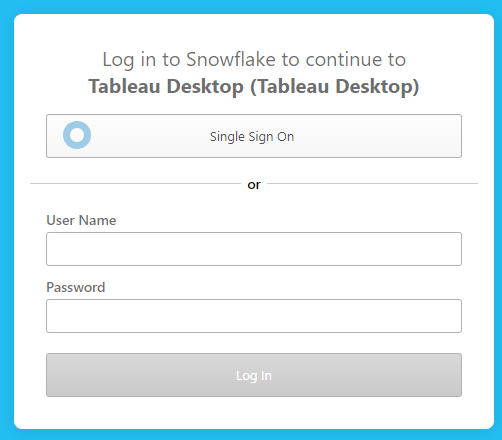
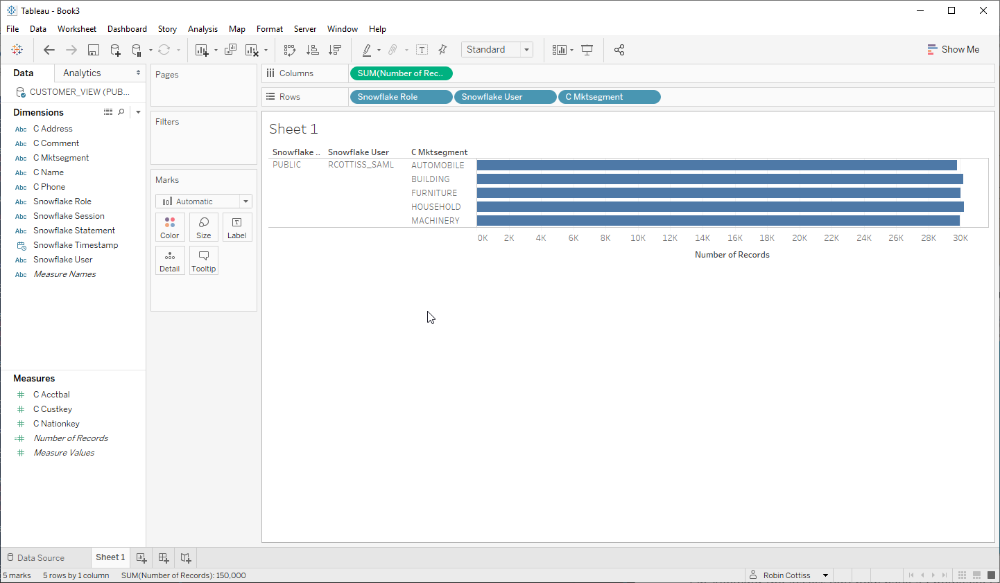
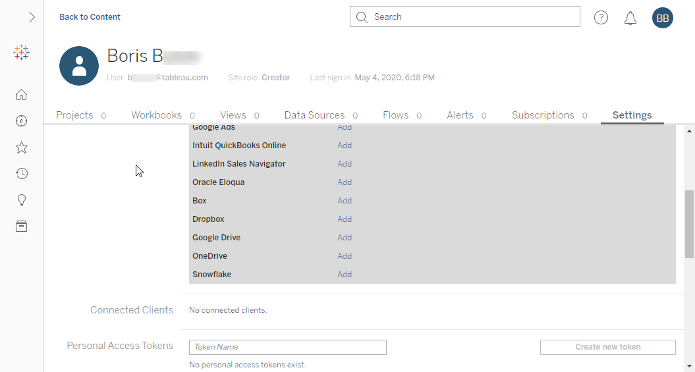

# Utilizing Snowflake's OAuth Support in Tableau Desktop and Tableau Server

How to integrate Tableau with Snowflake OAuth, SAML and MFA

<!-- omit in toc -->
## Table of Contents

- [Introduction](#introduction)
- [Requirements](#requirements)
- [Configure OAuth Partner Integration on Snowflake](#configure-oauth-partner-integration-on-snowflake)
- [Using OAuth for Snowflake in Tableau Desktop Connections](#using-oauth-for-snowflake-in-tableau-desktop-connections)
- [Using Snowflake Custom Roles in Tableau OAuth Credentials](#using-snowflake-custom-roles-in-tableau-oauth-credentials)
- [Summary](#summary)

## Introduction

Tableau Desktop and Server supports OAuth as an authentication mechanism for Snowflake. This article provides some guidance on how to set up OAuth on Snowflake and how leverage OAuth as a Tableau Desktop content creator and a Tableau Server content consumer. We will also cover how to take advantage of Snowflake's Role model from Tableau.

Although Tableau supports a direct SAML authentication scheme for Snowflake, in most situations you should consider OAuth as the preferred scheme for Tableau even you require SAML authentication. By using OAuth you can take advantage of interactive MFA for Content Creators and Consumers as well Seamless Sign-on for Content Consumers.

By leveraging Roles and Secure Views on Snowflake you can also implement fine grained permission control and Row and Column Level Security. This article will focus on the Tableau requirements to enable this but you can get more details about [Secure Views](https://docs.snowflake.com/en/user-guide/views-secure.html#working-with-secure-views) for example from the Snowflake documentation.

## Requirements

For this article we assume you are able to configure the  Oauth Partner Integration for Tableau Desktop and Server and have one or more test users, some useful views and and one or more custom roles in Snowflake. If you want to see the SSO flow for your Federation Provider the please enable Snowflake for SSO.

We will use Tableau Desktop and Server 2020.1 and the latest version of the Snowflake ODBC Driver (V2.21.2 as of May 4th 2020) installed on the desktop client and the server.

**Update - February 2021:** Starting with Tableau 2020.4 you can use a new OAuth Service that supports AWS PrivateLink or Azure Private Link VPCs withou the need to whitelist some IP addresses. [See the Tableau Help page for Snowflake](https://help.tableau.com/current/server/en-us/config_oauth_snowflake.htm) You may need to contact Snowflake Support.

It will be useful if you can have a Snowflake View that displays the current User and Role as this will help us confirm that Tableau is authenticating with the expected user context even when utilizing SSO later on in this article.

I created a copy of a Table from the SNOWFLAKE_SAMPLE_DATA Schema into the DEMO_DB Schema but you can use any table and Schema you prefer but you might want to make sure you have easy control over users and roles for your test schema. Snowflake has some very useful functions to show the current user, role etc. See [Scalar Functions Reference Documentation](https://docs.snowflake.com/en/sql-reference/intro-summary-operators-functions.html#scalar-functions) for details.

We will create a view with some added functions:

``` SQL
CREATE OR REPLACE VIEW DEMO_DB.PUBLIC.CUSTOMER_VIEW
(
   C_CUSTKEY
  ,C_NAME
  ,C_ADDRESS
  ,C_NATIONKEY
  ,C_PHONE
  ,C_ACCTBAL
  ,C_MKTSEGMENT
  ,C_COMMENT
  ,SNOWFLAKE_USER
  ,SNOWFLAKE_ROLE
  ,SNOWFLAKE_SESSION
  ,SNOWFLAKE_TIMESTAMP
  ,SNOWFLAKE_STATEMENT
  
)
AS
SELECT    C_CUSTKEY
  ,C_NAME
  ,C_ADDRESS
  ,C_NATIONKEY
  ,C_PHONE
  ,C_ACCTBAL
  ,C_MKTSEGMENT
  ,C_COMMENT
  ,CURRENT_USER()
  ,CURRENT_ROLE()
  ,CURRENT_SESSION()
  ,CURRENT_TIMESTAMP()
  ,CURRENT_STATEMENT()
FROM DEMO_DB.PUBLIC.CUSTOMER;
```

Make sure your user has access to this view:

``` SQL
GRANT SELECT
    ON ALL TABLES IN SCHEMA DEMO_DB.PUBLIC
    TO ROLE PUBLIC;

GRANT SELECT
    ON ALL VIEWS IN SCHEMA DEMO_DB.PUBLIC
    TO ROLE PUBLIC;
```

## Configure OAuth Partner Integration on Snowflake

OAuth must be configured on your Snowflake account as a Partner Integration before Tableau can used  OAuth as an authentication Scheme. See [Configure Snowflake OAuth for Partner Applications](https://docs.snowflake.com/en/user-guide/oauth-partner.html#configure-snowflake-oauth-for-partner-applications)

There is one integration for Tableau Desktop and one for Tableau Server. You can choose any Name but note that this will appear in the authorization prompts when users connect to Snowflake.

You can configure a refresh token validity. This validity is a time duration in seconds and will last from the time of login until the expiration time. When the refresh token expires the user will be asked to authenticate again if they access content associated with the token. We will describe later how a Tableau user may have more than one token in use at any time and why you might want to do that.

``` SQL
// Tableau Desktop
create or replace security integration if not exists "Tableau Desktop"
  type = oauth
  enabled = true
  oauth_refresh_token_validity = 36000 // e.g. 10 Hours
  oauth_client = tableau_desktop
  blocked_roles_list = ('SYSADMIN');

// Tableau Server
create or replace security integration if not exists  "Tableau Server"
  type = oauth
  enabled = true
  oauth_refresh_token_validity = 7776000 // e.g. 90 Days
  oauth_client = tableau_server
  blocked_roles_list = ('SYSADMIN');
```

If you have Single Sign On  for Snowflake (for example Okta SAML) you will be able to use SSO via the OAuth option in Tableau.

## Using OAuth for Snowflake in Tableau Desktop Connections

In Tableau Desktop create a new Snowflake Connection:


Note that we have left the **Role** field blank at this stage so we will be using the default role for the Snowflake user. Later we will take a closer look at using a specific role and how that can impact Tableau Server shared credentials and workbook/connection sharing with other users.

For the Authentication choose **Sign in using OAuth**

This will launch your default web browser and provide a login prompt. If Federated Login has been enabled you can choose Single Sign On. If you know your Snowflake username login is enabled you can enter that. In either case a successful login will create an OAuth token in desktop.



If you need to log in to your Idp you will be able to login and follow any MFA policies your IdP has in place:


If you already have a session in your IdP Single Sign On will automatically authenticate you to Snowflake.

Once you are authenticated you will be asked to authorize Tableau Desktop to access your Snowflake account. Click **Allow**:


You can close your Browser tab and return to Tableau Desktop.


Back in Tableau Desktop you can now build content using Snowflake:


Design a simple viz using the view we created earlier, or use any available table or view.


Now let's look at the Options for publishing this Workbook (or Data Connection)

In Tableau Desktop we will log into a Tableau Server:


Right now there are two options for the Data Source Authentication **Prompt User** or **Embedded Password**. **Embedded Password** should not be selected in this context. You should select Prompt User. Do not worry, while prompt user is what you need to select you will see that the user will not always be prompted. What this option really means in the context of a Snowflake OAuth connection is _**The published Workbook or Data Source will use the Saved Credentials on Tableau Server - If there are no saved Credentials the user will be prompted to authenticate to Snowflake**_. You will see what that means exactly in a little while.


After the workbook is published:


You can access it on Tableau Server. Because there is no Snowflake credential saved on Server yet you will be prompted to Sign In to Snowflake:


Because we originally connected to Snowflake using OAuth you will be taken into the OAuth flow for Server.


Similar to Desktop you can choose SSO or username/password sign in. Remember though that even if you use username/password it will be an OAuth Toke that will be stored on Tableau Server.

I selected Single Sign On:


Now you will get an Authorization prompt for Tableau Server:


On Allowing the access you now have a Snowflake OAuth token as a Tableau Saved Credential for Snowflake. This token will last 90 days. You can confirm the existence of the Token by looking at your account settings on Tableau Server.


Now that this credential exists on your Tableau Server user account it will be used any time you access a view requiring these credentials. We will soon see that each user can maintain several Snowflake credentials depending on some how you as the customer wants to leverage Snowflake user accounts and user roles. Before we look at some of these advanced concepts let's take a look at how the Tableau Desktop publishing behavior changes now we have a saved Snowflake Credential.

Let's go back to Tableau Desktop and create a new Workbook. Create a sheet using the same Snowflake View and make sure to add the Snowflake User and Role so we can use them later to prove we can get seamless authentication for another user.



Let's publish this workbook and see what options are available for authentication. We have a new option - you can now choose to embed the saved credential for RCOTTISS_SAML. This is the saved credential we created earlier.


After publishing anybody with access to this viz, **and** the underlying data in Snowflake, will **not** be prompted to authenticate to Snowflake because it will use RCOTTISS_SAML's credentials and they are available as a Saved Credential on the Server.

Let's explore this behavior with a different Tableau Server and Snowflake user.

Boris B. has access to our recently published vizzes:


Note that he does not have any Saved Credentials for Snowflake:



Even though Boris has no saved credentials for Snowflake if he views **Snowflake Viz2** he will **not** be prompted to authenticate to Snowflake:


The reason for no sign in prompt is because, when we published Viz2, we effective told Tableau Server to use the Credentials Saved for RCOTTISS_SAML. Note the Role is **PUBLIC** that is the Role we used when connecting on Desktop.

What about **Snowflake Viz1**?

Boris will be Prompted to Sign In to Snowflake:


Selecting Single Sign-On he will need to authenticate to Okta.

**Note**: If you are testing this in the same browser you will need to clear your Okta Session from the previous user because you may have an active session for your SAML IdP.


Boris B. will get an OAuth Authorization prompt:


Clicking on Allow will take Boris to **Snowflake Viz1**. Note that the user is Bxxxxx. So, even though we published the Workbook as RCOTTISS_SAML, Boris is authenticated to Snowflake as himself. For the next 90 days he will not be prompted again if hi connects to any data on this Snowflake server that is accessible under his default Role. The Snowflake Role is PUBLIC because that was the Default Role used when RCOTTISS_SAML connected from Desktop, but both users Authorized Tableau to use the explicit Role **PUBLIC**. If either user's default Role was to change for some reason the authorization would not change to that new Role.

If we look at Boris B.'s account settings we will see he has a Saved Credential for Snowflake.


## Using Snowflake Custom Roles in Tableau OAuth Credentials

Strictly speaking this topic is about non-default Roles in Snowflake but I do not expect real world use cases to be using any built-in roles other than **PUBLIC**.

In Tableau 2020.1 we added the ability to define an explicit Role in the Snowflake connection dialog. You can find a lot of documentation about Roles in the [Snowflake Access Control Documentation](https://docs.snowflake.com/en/user-guide/security-access-control.html)

Let's consider the case where you grant a custom role to a group of Snowflake users that will access live data from Snowflake. Some of the users will be Content Creators and some will be Consumers. This discussion applies to Tableau Desktop and Server because with Web Editing and Shared Connections you can have Creators and Consumers on Desktop or Server.

First we need a custom group to allow us to create some examples. In the Snowflake console we will create a group called ```role_access_to_sf1``` and grant appropriate privileges to the new Role.

``` SQL
create role role_access_to_sf1
   comment = 'This role has read privileges on SCHEMA PUBLIC in DEMO_DB';

grant role role_access_to_sf1
   to user rcottiss_saml;

grant role role_access_to_sf1
   to user bbxxxx;

grant usage
  on warehouse COMPUTE_WH
  to role role_access_to_sf1;

grant usage
  on database DEMO_DB
  to role role_access_to_sf1;
  
grant usage
  on schema DEMO_DB.PUBLIC
  to role role_access_to_sf1;

GRANT SELECT
    ON ALL TABLES IN SCHEMA DEMO_DB.PUBLIC
    TO ROLE role_access_to_sf1;

GRANT SELECT
    ON ALL VIEWS IN SCHEMA DEMO_DB.PUBLIC
    TO ROLE role_access_to_sf1;
```

We can now create some content with a user that has the role and consume it with a user with the role. We could do this exactly the same way as above but this time we will create the consumer's Credentials on Tableau Server before publishing and consuming to show how we can create and Save Credentials on Tableau Server.

In the Account Settings for Boris B. click **Add** next to Snowflake in the Saved Credentials section. Enter the server name _and_ the role we just created.


Click **Add** and we will authenticate to the our SAML IdP and authorize.


Note that this time the Authorization is for our new Role.


After clicking **Allow** we now have a second credential for Boris B. for the Role ```role_access_to_sf1```.

Now we will create some content using the ```role_access_to_sf1```. In desktop we will create a new Viz as RCOTTISS_SAML and publish it.


RCOTTISS_SAML does not have a Saved Credential for Role ```role_access_to_sf1``` so I get prompted to create the credential.


After Authorizing I can view on Server.


If Boris B. views Viz3 he will _not_ be prompted for credentials because the credential already exists.


Note the User and the Role.

## Summary

We have shown how Tableau customers can leverage Snowflakes support for strong security and access control by using Tableau's support for Snowflake OAuth using Saved Credentials that can be tied to Snowflakes security and permission model in the form of Roles and Secure Views. In most cases OAuth will be the preferred authentication mechanism for Tableau to Snowflake as will give the best balance of functionality, strong security and ease of use for users.
